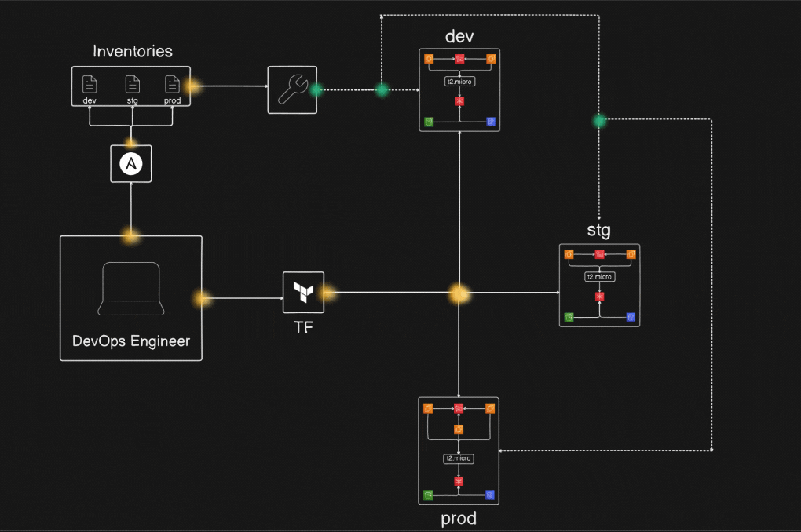

# 🌍 Terraform & Ansible Multi-Environment DevOps Project

> **For Learning & Hands-On Practice**

---




---

## 🚀 What is this Project?

This project is a **step-by-step, hands-on guide** to building a robust, real-world DevOps pipeline for **multi-environment infrastructure** using:

- **Terraform** for cloud provisioning (AWS)
- **Ansible** for configuration management
- **Dynamic inventories** for seamless multi-env (dev, staging, prod) automation

You'll learn to design, provision, configure, and automate infrastructure **from scratch**—all in a way you can reuse for any professional project!

---

## 🧑‍💻 Who is this for?

- Students & self-learners exploring DevOps
- Engineers wanting to practice real-world multi-env automation
- Anyone who loves combining **Terraform + Ansible** for cloud infrastructure

---

## 🏗️ Core Concepts You’ll Learn

- Infrastructure as Code (IaC) with **Terraform**
- Multi-environment modules and state management
- Configuration as Code with **Ansible** (roles, playbooks, dynamic inventories)
- Automating Nginx install and basic web deployment
- Fetching outputs from Terraform to Ansible (dynamic inventory)
- End-to-end infrastructure lifecycle: **provision → configure → destroy**

---

## 🗂️ Project Structure

```text
.
├── terraform/
│   ├── infra/                # Modular Terraform code for AWS resources
│   ├── main.tf               # Multi-environment orchestration (dev/stg/prod)
│   ├── providers.tf          # AWS provider config
│   ├── terraform.tf          # Backend config
│   └── devops-key*           # SSH keys for EC2
├── ansible/
│   ├── inventories/          # Dynamic inventories for each env
│   ├── playbooks/
│   │   ├── install_nginx_playbook.yml
│   │   └── nginx-role/       # Ansible Galaxy role for Nginx
│   └── update_inventories.sh # Auto-update inventories from Terraform outputs
└── README.md
```

---

## 🔥 Quick Start (Learning Edition)

### 1. **Setup Tools**

- **Terraform:**  
  ```bash
  sudo apt-get update
  sudo apt-get install -y gnupg software-properties-common
  curl -fsSL https://apt.releases.hashicorp.com/gpg | sudo gpg --dearmor -o /usr/share/keyrings/hashicorp-archive-keyring.gpg
  echo "deb [signed-by=/usr/share/keyrings/hashicorp-archive-keyring.gpg] https://apt.releases.hashicorp.com $(lsb_release -cs) main" | sudo tee /etc/apt/sources.list.d/hashicorp.list
  sudo apt-get update && sudo apt-get install terraform
  terraform --version
  ```

- **Ansible:**  
  ```bash
  sudo apt-add-repository ppa:ansible/ansible
  sudo apt update
  sudo apt install ansible
  ansible --version
  ```

---

### 2. **Provision Infrastructure with Terraform**

```bash
cd terraform
ssh-keygen -t rsa -b 2048 -f devops-key -N ""
terraform init
terraform plan
terraform apply
```
- Creates EC2, S3, DynamoDB—for dev, stg, prod!
- Outputs public IPs for Ansible

---

### 3. **Configure Servers with Ansible**

```bash
cd ../ansible
./update_inventories.sh  # Dynamically updates inventories with EC2 IPs
ansible-playbook -i inventories/dev playbooks/install_nginx_playbook.yml
ansible-playbook -i inventories/stg playbooks/install_nginx_playbook.yml
ansible-playbook -i inventories/prod playbooks/install_nginx_playbook.yml
```
- Installs Nginx and uploads a web page to all servers in each environment

---

### 4. **See It in Action**

- Visit EC2 public IPs in your browser:  
  `http://<ec2-public-ip>`  
  You should see your custom Nginx page!

---

### 5. **Destroy Everything (Cleanup)**

```bash
cd ../terraform
terraform destroy --auto-approve
```

> ⚠️ **Caution:** This will delete all AWS resources created by the project.

---

## 🎯 Learning Outcomes

- Understand IaC and config management synergy
- Create reusable, modular cloud infrastructure
- Practice real DevOps workflows used in industry
- Automate everything, document everything!

---

## 📚 Further Exploration

- Dive into [`terraform/infra`](terraform/infra) for modular code examples
- Explore [`ansible/playbooks/nginx-role`](ansible/playbooks/nginx-role) for role-based config
- Try adding more roles or cloud resources!

---

## 🤝 Contributing

Contributions, suggestions, and corrections are welcome!  
Feel free to fork and submit a pull request!

## 📄 License

MIT  Free for personal and educational use.

## 🙋‍♂️ Maintained by Saifeez Ibrahim
If you found this helpful, star ⭐ the repo or share it to help more people learn DevOps!

Need help or want to connect? [Reach out on GitHub!](https://github.com/saifeezibrahim)

---

> Made with ❤️ for the DevOps community.  
> Learn, break things, automate and have fun!

Happy learning!
